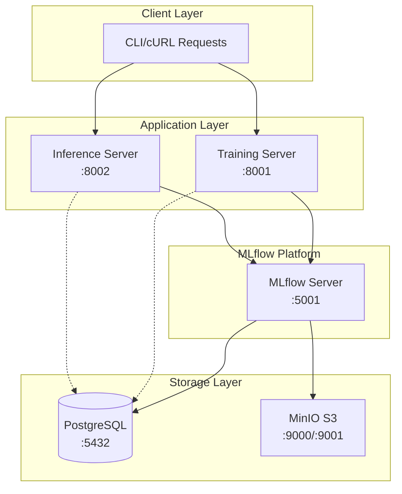
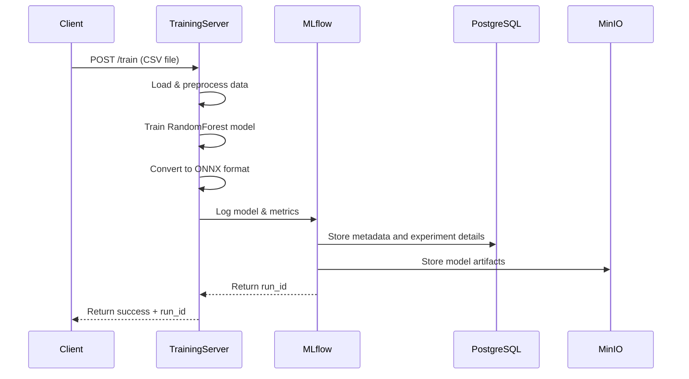
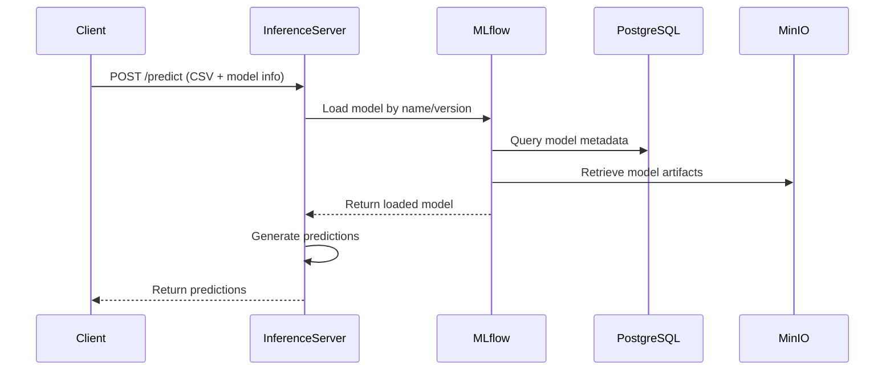

# Model Distribution Server

A comprehensive MLOps platform for training, managing, and serving machine learning models with MLflow integration.

## 🏗️ Architecture Overview



## 🔄 Training Flow



## 🔮 Inference Flow



## 🚀 Features

- **Model Training**: Automated ML pipeline with RandomForest regression
- **Model Versioning**: MLflow-based model registry and versioning
- **Format Support**: Both Scikit-learn and ONNX model formats
- **RESTful APIs**: FastAPI-based training and inference endpoints
- **Scalable Storage**: PostgreSQL + MinIO S3-compatible storage
- **Containerized**: Docker Compose for easy deployment

## 📋 Prerequisites

- Docker & Docker Compose
- Python 3.9+
- pip
- ollama

## 🛠️ Setup & Installation

### 1. Start Infrastructure Services

```bash
# Start MLflow stack (PostgreSQL, MinIO, MLflow Server)
docker compose up -d
```

Wait for services to be ready:
- MLflow UI: http://localhost:5001
- MinIO Console: http://localhost:9001 (minio/minio123)
- MDS Client UI: http://localhost:8501

__Please create a bucket called `mlflow` in MinIO before proceeding:__

### 2. Install Dependencies

```bash
# Training server dependencies
pip install -r mds_train_server/requirements.txt

# Inference server dependencies  
pip install -r mds_inference_server/requirements.txt

# Install Ollama for model serving
ollama pull llama2
```

### 3. Start Application Servers

```bash
# Terminal 1: Training Server
uvicorn mds_train_server.app:app --reload --port 8001

# Terminal 2: Inference Server
uvicorn mds_inference_server.app:app --reload --port 8002

# Start Llama2 model server
ollama serve
```

### ALTERNATIVE QUICK START
Upon first clone, run:
```bash
chmod +x start.sh
chmod +x end.sh
```

Then start all services with:
```bash
./start.sh
```

To end all services, run:
```bash
./end.sh
```

## 📊 Data Format

The system expects CSV files with the following structure:

```csv
timestamp,feature1,feature2,...,target
2025-08-19,0.1,55,72,42
2025-08-20,0.2,57,71,45
```

**Required columns:**
- `timestamp`: Date/time identifier
- `target`: Dependent variable for training
- `feature*`: Independent variables for model training

## 🔧 API Usage

### Training Endpoints

**Train a new model:**
```bash
curl -X POST \
  -F "file=@sample_data/<dataset>.csv" \
  -F "model_name=<model_type>" \
  http://localhost:8001/train
```

**Purge all MLflow experiments, models, and MinIO bucket contents:**
```bash
curl -X POST http://localhost:8001/purge
```

**List all experiments:**
```bash
curl http://localhost:8001/experiments
```

**List all registered models:**
```bash
curl http://localhost:8001/models
```

**Get model details:**
```bash
curl http://localhost:8001/models/<model_name>
```

**Get runs for an experiment:**
```bash
curl http://localhost:8001/experiments/<experiement_id>/runs
```

**Get MLflow statistics:**
```bash
curl http://localhost:8001/stats
```

### Inference Endpoints

**Generate predictions:**
```bash
curl -X POST \
  -F "file=@sample_data/time_series_weather.csv" \
  "http://localhost:8002/predict?model_name=<model_name>&version=1"
```

**List available models for inference:**
```bash
curl http://localhost:8002/available-models
```

**Get model versions:**
```bash
curl http://localhost:8002/models/<model_name>/versions
```

**Get latest model version:**
```bash
curl http://localhost:8002/models/<model_name>/latest
```

**Get model input schema:**
```bash
curl http://localhost:8002/models/<model_name>/predict-schema
```

**Summarize experiement with Llama2:**
```bash
curl -X POST \
  -F "data_context=@sample_data/<dataset>.csv" \
  "http://localhost:8002/summarize?model_name=<model_name>&experiment_id=<experiment_id>"
```

**Predictions:**
```bash
curl -X POST \
  -F "files=@sample_data/time_series_weather.csv" \
  "http://localhost:8002/batch-predict?model_name=<model_name>"
```

**Get inference statistics:**
```bash
curl http://localhost:8002/inference-stats
```

## 📊 API Response Examples

### Training Response:
```json
{
  "status": "success",
  "trained_models": ["abc123def456..."]
}
```

### Models List Response:
```json
{
  "models": [
    {
      "name": "rf_regressor",
      "creation_timestamp": 1692460800000,
      "latest_versions": [
        {
          "version": "1",
          "stage": "None",
          "status": "READY"
        }
      ]
    }
  ],
  "count": 1
}
```

### Prediction Response:
```json
{
  "predictions": [42.3, 45.1, 44.7, ...]
}
```

## 🔌 Complete API Reference

### Training Server (Port 8001)

| Endpoint | Method | Description |
|----------|--------|-------------|
| `/train` | POST | Train a new model with CSV data |
| `/purge` | POST | Delete all MLflow experiments, models, and MinIO bucket contents |
| `/experiments` | GET | List all MLflow experiments |
| `/experiments/{id}/runs` | GET | Get runs for specific experiment |
| `/models` | GET | List all registered models |
| `/models/{name}` | GET | Get detailed model information |
| `/models/{name}/versions/{version}` | GET | Get specific model version details |
| `/runs/{run_id}` | GET | Get detailed run information |
| `/metrics` | GET | Get metrics summary across runs |
| `/search/runs` | GET | Search runs with advanced filters |
| `/stats` | GET | Get MLflow statistics |
| `/health` | GET | Health check |

### Inference Server (Port 8002)

| Endpoint | Method | Description |
|----------|--------|-------------|
| `/predict` | POST | Generate predictions for single file |
| `/batch-predict` | POST | Generate predictions for multiple files |
| `/available-models` | GET | List models available for inference |
| `/models/{name}/versions` | GET | Get all versions for a model |
| `/models/{name}/latest` | GET | Get latest working model version |
| `/models/{name}/predict-schema` | GET | Get model input schema/features |
| `/inference-stats` | GET | Get inference server statistics |
| `/health` | GET | Health check |

## 📋 Model Registry

Below is an example of how models are registered in MLflow. Only the model name and available metrics are shown:

| Model Name     | Metrics Available                                                                                           |
|----------------|------------------------------------------------------------------------------------------------------------|
| rf_regressor   | r2_score, mae, mse, rmse, explained_variance, median_absolute_error, max_error, mean_squared_log_error, mean_poisson_deviance, mean_gamma_deviance, mean_tweedie_deviance, mean_absolute_percentage_error, mean_pinball_loss |
| svm_regressor  | r2_score, mae, mse, rmse, explained_variance, median_absolute_error, max_error, mean_squared_log_error, mean_poisson_deviance, mean_gamma_deviance, mean_tweedie_deviance, mean_absolute_percentage_error, mean_pinball_loss |
| rf_classifier  | accuracy, f1_score, precision, recall                                                                      |

To view the actual metric values for each model and run, navigate to the corresponding experiment in the MLflow UI: [http://localhost:5001](http://localhost:5001)

## 🗂️ Project Structure

```
model-distribution-server/
├── mds_train_server/           # Training service
│   ├── app.py                  # FastAPI training app
│   ├── trainer.py              # ML training logic
│   ├── onnx_converter.py       # Model format conversion
│   ├── mlflow_utils.py         # MLflow integration
│   └── requirements.txt        # Training dependencies
├── mds_inference_server/       # Inference service
│   ├── app.py                  # FastAPI inference app
│   ├── loader.py               # Model loading utilities
│   ├── predictor.py            # Prediction logic
│   └── requirements.txt        # Inference dependencies
├── sample_data/                # Example datasets
│   └── time_series_weather.csv # Sample training data
├── docker-compose.yml          # Infrastructure setup
└── README.md                   # This file
```

## 🏪 MLflow Model Registry

Models are automatically registered in MLflow with:

- **Model Name**: I.e. `rf_regressor`
- **Formats**: Scikit-learn + ONNX
- **Metrics**: R² score
- **Versioning**: Automatic increment

Access the MLflow UI at http://localhost:5001 to:
- Browse trained models
- Compare model performance
- Manage model versions
- View training metrics

## 📦 Minio S3 Artifact Store
Models and artifacts are stored in MinIO, an S3-compatible object storage service. The default bucket is `mlflow`.

The structure is as follows:

```
models/
├── models/
│   ├── <model_id>/
│   │   ├── artifacts/

## 🐳 Docker Services

| Service | Port | Purpose |
|---------|------|---------|
| PostgreSQL | 5432 | MLflow metadata store |
| MinIO | 9000, 9001 | S3-compatible artifact storage |
| MLflow Server | 5001 | Model registry & tracking |
| Training Server | 8001 | Model training API |
| Inference Server | 8002 | Model prediction API |

